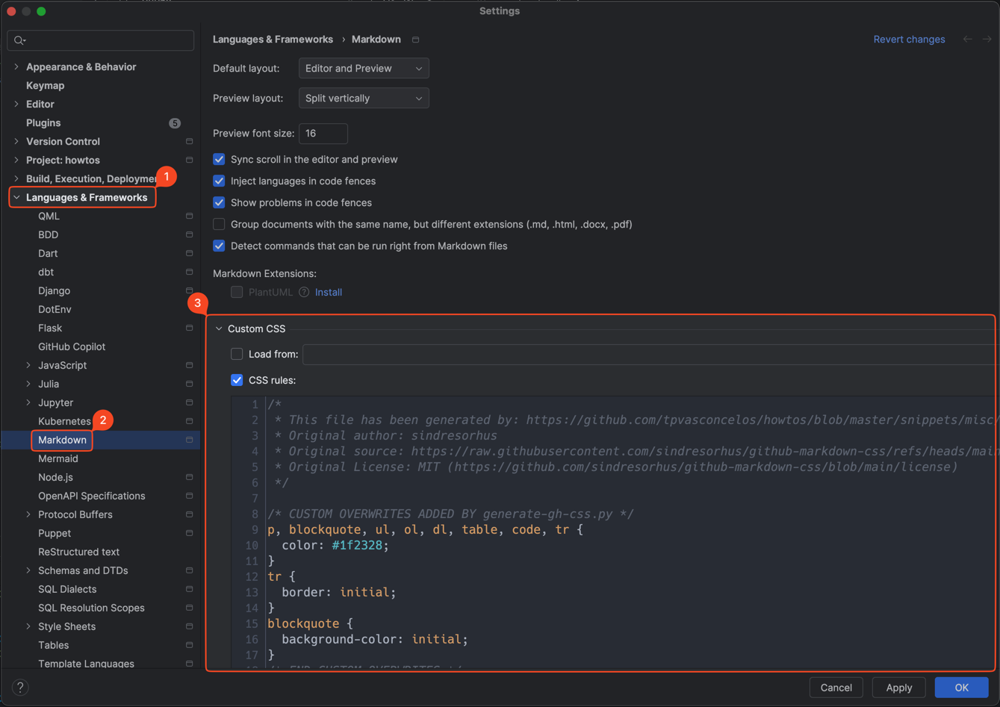

# Miscellaneous how-tos, and code snippets

## Shell

### Ask for `sudo` password only once

Add this to the top of your shell script.

```shell script
################################################################################
# Ask for root password upfront and keep updating the existing `sudo`
# timestamp on a background process until the script finishes. Note that
# you'll still need to use `sudo` where needed throughout the scripts.
################################################################################
echo "Some of the commands in this script require root access. Enter your password to unable root access when necessary..."
sudo -v
while true; do
  sudo -n true
  sleep 30
  kill -0 "$$" || exit
done 2>/dev/null &
```

### `ffmpeg` - Video from images

```shell script
ffmpeg -framerate 24.994862 -i img%06d.png -c:v libx264 -vf fps=24.994862 -pix_fmt yuv420p myMovie.mp4
```

### [FIXME] Remove local CloudDocs copies

```shell script
# $ source ~/.zshrc

function _safer_evict() {
  input_path=$(realpath "$@")/
  # shellcheck disable=SC2034
  path_to_icloud=$(realpath ~/Library/Mobile\ Documents/com~apple~CloudDocs)/
  if [[ "${input_path##path_to_icloud}" != "${input_path}" ]]; then
    echo yes;
    echo "$input_path";
  fi
}

function _evictall() {
  _SAFER_EVICT=$(functions _safer_evict)
  #find "$1" -type f -not -name .DS_Store -a -not -name .\*.icloud -exec "$SHELL" -c '_safer_evict "$@"' -- {} \;
  #find "$1" -type f -not -name .DS_Store -a -not -name .\*.icloud -exec zsh -c '_safer_evict "$@"' zsh {} \;
  #  find "$1" -type f -not -name .DS_Store -a -not -name .\*.icloud -print0 | xargs -0 ls
  #find "$1" -type f -not -name .DS_Store -a -not -name .\*.icloud -print0 | xargs -0 bash -c '_safer_evict "$@"' _
  #find "$1" -type f -not -name .DS_Store -a -not -name .\*.icloud -print0 | xargs -0 -I{} "$SHELL" -c "eval $_SAFER_EVICT; _safer_evict {}"
  find "$1" -type f -not -name .DS_Store -a -not -name .\*.icloud -print0 | xargs -0 -I{} "$SHELL" -c "eval ${_SAFER_EVICT}; ls {}"
}

_evictall "$1"

```

## SQL

### Compare two queries

Use the following template to get the difference between two queries:

```sql
with q1 as (
    <INSERT_QUERY_1_HERE>
)
, q2 as (
    <INSERT_QUERY_2_HERE>
  )
select * from q1 except select * from q2
union all (
select * from q2 except select * from q1);
```

References:

- <https://stackoverflow.com/questions/11017678/sql-server-compare-results-of-two-queries-that-should-be-identical/63380681#63380681>

### [Amazon Redshift] Disable results caching for current session

```sql
set enable_result_cache_for_session to off;
```

References:

- <https://docs.aws.amazon.com/redshift/latest/dg/r_enable_result_cache_for_session.html>

## Kubernetes

### Sync current git working tree to a k8s pod

This utility helps you sync your current git working tree with a remote k8s pod. This assumes that the project
is cloned under `/home/jovyan` on the remote pod. The repository name will be inferred from the current
repository using `git rev-parse --show-toplevel`. For this to work, you also need to have rsync installed in
the remote k8s pod (run: `sudo apt install rsync grsync`). Note that the `.git/` directory will not be synced.
In addition to this, nothing in `.gitignore` will be synced.

Simply add a copy of [snippets/k8s/krsync.zsh](snippets/k8s/krsync.zsh) and
[snippets/k8s/krsync-subshell.sh](snippets/k8s/krsync-subshell.sh) to the top level directory of your git
repository and run `./krsync.zsh my-pod`.

- <https://serverfault.com/questions/741670/rsync-files-to-a-kubernetes-pod>

## Misc

### GitHub Markdown style on JetBrains IDEs

Inspired and adapted from <https://github.com/sindresorhus/github-markdown-css>

1. Open the `Preferences -> Language & Frameworks -> Markdown`
2. Copy the contents of [snippets/misc/github-markdown.css](snippets/misc/github-markdown.css) into the open
   text box under `Custom CSS -> Add CSS rules`



References:

- <https://www.jetbrains.com/help/idea/markdown.html#css>
